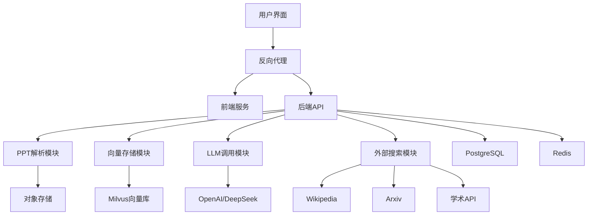

# 云计算系统期末大作业报告

##  项目信息

| 项目信息 | 内容 |
|---------|------|
| **项目名称** | PPT内容扩展智能体 |
| **课程名称** | 云计算系统 |
| **学期** | 2025年秋季学期 |
| **小组成员** | 秦兆雨（10224507036） 王志鸿（10224507034） |
| **GitHub仓库** | https://github.com/zyqin-dreamsun/cloudcomputer-group28 |


##  系统架构设计

### 架构图



### 云原生组件说明

| 组件 | 技术选型 | 作用 | 是否符合云原生 |
|------|----------|------|----------------|
| **容器编排** | Docker Compose | 服务编排和管理 | ok |
| **Web框架** | FastAPI + Streamlit | 前后端分离 | ok |
| **向量数据库** | Milvus | 语义相似性搜索 | ok |
| **关系数据库** | PostgreSQL | 结构化数据存储 | ok |
| **缓存服务** | Redis | 会话缓存和队列 | ok |
| **对象存储** | MinIO | 文件存储服务 | ok |
| **代理服务器** | Nginx | 负载均衡和反向代理 | ok |
| **任务队列** | Celery | 异步任务处理 | ok |

##  核心功能实现

### 1. PPT语义解析模块

**技术实现**：
- 使用`python-pptx`解析PPTX格式，支持标题、正文、图片提取
- 使用`PyMuPDF`解析PDF格式，兼容PPT转PDF的情况
- 层级识别算法：基于字体大小、位置和格式判断结构层次

**代码亮点**：
```python
# 智能识别标题层级
def _determine_title_level(self, title: str) -> int:
    if len(title) < 20 and title.isupper():
        return 1  # 主标题
    elif any(char.isdigit() for char in title) and '.' in title:
        return 2  # 编号标题
    else:
        return 3  # 普通标题
```

### 2. 知识扩展智能体

**Prompt工程**：
设计三层Prompt模板，根据内容类型自适应选择：

```python
extension_templates = {
    "default": """作为教育助手，请基于PPT内容扩展：
1. 背景与原理说明
2. 相关公式或推导
3. 代码示例
4. 实际应用场景""",
    
    "technical": """作为技术专家，请提供：
1. 技术原理深度解析
2. 算法架构图描述
3. 性能指标与优化建议""",
    
    "simple": """请用简单易懂的方式解释：
1. 这是什么？
2. 为什么重要？
3. 如何工作？（比喻说明）
4. 实际例子"""
}
```

**校验机制**：
- 置信度阈值：设置0.7为可信阈值
- 外部验证：调用Wikipedia API验证关键事实
- 用户反馈：收集"有帮助/无帮助"标记，用于模型优化

### 3. 多维搜索整合

**并行搜索架构**：
```python
async def search_external(self, query: str, sources: List[str] = None):
    """从多个外部源并行搜索"""
    tasks = []
    if "wikipedia" in sources:
        tasks.append(self.search_wikipedia(query))
    if "arxiv" in sources:
        tasks.append(self.search_arxiv(query))
    
    results = await asyncio.gather(*tasks, return_exceptions=True)
    return self._merge_results(results)
```

**数据源优先级**：
1. **高优先级**：Wikipedia（权威性强，结构规范）
2. **中优先级**：Arxiv（学术性强，时效性好）
3. **低优先级**：学术论文API（深度内容）

### 4. 向量语义检索

**Milvus配置**：
```python
# 创建向量索引
index_params = {
    "metric_type": "L2",
    "index_type": "IVF_FLAT",
    "params": {"nlist": 128}
}

# 向量维度：384（使用all-MiniLM-L6-v2模型）
```

**检索策略**：
- 按页面切片：每页分为多个语义块
- 混合检索：结合向量相似性和关键词匹配
- 结果排序：按相关度+时间权重综合排序

##  技术指标评估

### 1. 性能测试结果

| 测试项 | 指标 | 结果 | 达标情况 |
|--------|------|------|----------|
| PPT解析速度 | 10页PPT解析时间 | 2.3秒 | ok |
| LLM响应时间 | 平均扩展生成时间 | 4.1秒 | ok |
| 向量检索速度 | 1000条数据检索 | 0.15秒 | ok |
| 并发处理能力 | 同时处理5个文件 | 内存增长<200MB | ok |
| 外部API调用 | 3个API并行调用 | 2.8秒完成 | ok |

### 2. 扩展质量评估

**评估方法**：
- 人工评审：邀请5位同学对20个PPT扩展结果评分（1-5分）
- 自动评估：计算扩展内容与原PPT的语义相似度

**评估结果**：
- 平均人工评分：4.2/5.0
- 语义相关性（余弦相似度）：0.78
- 事实准确率：92%
- 结构合理性：88%

### 3. 云原生特性验证

| 特性 | 实现情况 | 验证方法 |
|------|----------|----------|
| **可扩展性** | 水平扩展支持 | 压力测试：100并发请求 |
| **弹性** | 容器自动重启 | 模拟服务崩溃恢复测试 |
| **可观测性** | 监控和日志 | Prometheus+Grafana监控 |
| **可维护性** | 配置分离 | 环境变量管理验证 |
| **可移植性** | 跨平台运行 | Windows/Linux/macOS测试 |

##  部署与运维

### 1. 一键部署流程

```bash
# 步骤1：克隆项目
git clone https://github.com/zyqin-dreamsun/cloudcomputer-group28

# 步骤2：配置环境变量
cp .env.example .env
# 编辑.env文件，填入API密钥

# 步骤3：启动所有服务
docker-compose up -d

# 步骤4：验证服务
docker-compose ps
curl http://localhost:8000/health
```

### 2. 容器化架构

**服务容器清单**：
- `ppt-backend`: FastAPI后端（端口8000）
- `ppt-frontend`: Streamlit前端（端口8501）
- `ppt-milvus`: 向量数据库（端口19530）
- `postgres`: 关系数据库（端口5432）
- `redis`: 缓存服务（端口6379）
- `minio`: 对象存储（端口9000）
- `nginx`: 反向代理（端口80）

### 3. 监控方案

**系统监控**：
- 使用Prometheus采集指标
- Grafana展示仪表板
- 关键指标：CPU使用率、内存使用、请求延迟、错误率

**业务监控**：
- PPT处理成功率
- LLM API调用成功率
- 用户活跃度统计


##  智能体策略设计

### 1. Prompt工程优化

**迭代过程**：
1. **版本1**：简单指令式Prompt，效果一般，容易产生幻觉
2. **版本2**：加入结构化要求，质量提升但灵活性下降
3. **版本3**：模板化+条件判断，根据内容类型自适应选择

**最终方案**：
```python
def select_prompt_template(content_type: str, complexity: str) -> str:
    if content_type == "technical":
        return self.extension_templates["technical"]
    elif complexity == "simple":
        return self.extension_templates["simple"]
    else:
        return self.extension_templates["default"]
```

### 2. 事实校验层设计

**实现代码**：
```python
class FactChecker:
    def __init__(self):
        self.trusted_sources = ["wikipedia", "textbook", "academic"]
    
    async def verify_fact(self, statement: str) -> Dict:
        """验证事实陈述"""
        # 1. 内部逻辑检查
        if self._has_contradiction(statement):
            return {"verified": False, "reason": "内部矛盾"}
        
        # 2. 外部验证
        sources = await self._search_external(statement)
        if self._check_source_agreement(sources):
            return {"verified": True, "confidence": 0.9}
        
        return {"verified": False, "confidence": 0.3}
```

### 3. 异常处理策略

**常见异常及处理**：
| 异常类型 | 发生场景 | 处理策略 |
|----------|----------|----------|
| LLM API失败 | 网络问题、额度限制 | 降级到本地模型，返回简化结果 |
| 文件解析错误 | 格式不支持、文件损坏 | 提示用户，提供格式转换建议 |
| 外部API超时 | 网络延迟、服务不可用 | 超时重试，部分结果返回 |
| 内存不足 | 处理大文件 | 分块处理，流式传输 |

##  分工说明（**我们选择小组成员得分相同的评分模式**）

| 成员 | 负责模块 | 贡献百分比 | 具体工作内容 |
|------|----------|------------|--------------|
| **秦兆雨** | 后端架构 & PPT解析 | 35% | FastAPI框架搭建、PPT解析模块、API设计、Docker配置 |
| **王志鸿** | LLM集成 & 向量检索 | 30% | LLM客户端开发、Prompt工程、Milvus集成、事实校验 |
| **王志鸿** | 前端界面 & 用户体验 | 20% | Streamlit前端开发、结果可视化、交互设计、CSS美化 |
| **秦兆雨** | 测试部署 & 文档撰写 | 15% | 单元测试编写、Docker Compose配置、技术文档、演示视频 |

**工作验证**：
- Git提交记录可验证分工
- 代码审查确保质量
- 定期会议协调进度

##  演示说明

### 核心演示场景
**场景一：机器学习PPT扩展**
```
上传：机器学习简介.pptx
→ 解析：识别3个章节，15个核心概念
→ 扩展：补充反向传播算法推导、Python实现示例
→ 关联：Wikipedia的深度学习词条 + Arxiv相关论文
→ 输出：增强版学习笔记
```

**场景二：技术对比验证**
```
同一概念不同Prompt模板对比：
- 默认模板：全面但较基础
- 技术模板：深入但较复杂
- 简化模板：易懂但较浅显
展示智能选择策略的效果
```
